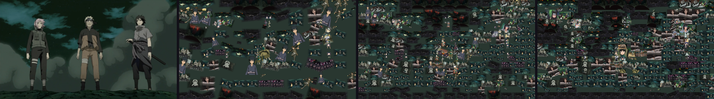

# Mosaic

Mosaic is an Android app that builds a photographic mosaic from your own pictures. The matching engine is pure Kotlin in the `:engine` module, so the algorithm, tests, and benchmarks run on a normal JVM. The Android app handles the camera, gallery, project library, and on-device subject segmentation.

## Architecture

```
:engine   color, descriptors, index, matcher, renderer, coordinator
:app      Compose UI, Room, Keystore, bitmap decode, ML Kit
```

Generation is coordinated by `GenerationCoordinator` and runs in this order:

1. Loading
2. Analyzing
3. Indexing
4. Matching
5. Rendering
6. Saving
7. Complete

Progress events are throttled by time. Cancel stops the coroutine between tiles and cells. Preview and the full render use the same matcher and the same seed. They differ by output resolution. A full render can reuse the preview's tile plan when the target, library, and matching settings are unchanged.

Full-resolution output is written scanline by scanline with `StreamingPngWriter`. The image is never one giant bitmap, and the manifest does not set `android:largeHeap`.

## Matching

Each tile is described once and cached. A descriptor stores:

- OKLab color, luminance, and saturation
- a 4×4×4 OKLab histogram
- a 4×4 spatial OKLab grid
- edge density
- alpha coverage and aspect ratio

The cache key is the URI, pixel size, byte size, modified time, and algorithm version. Adding or removing one photo does not rebuild the other descriptors.

Tiles are placed in an 8×8×8 OKLab bin index. For each target cell the matcher asks for a small candidate set: nearby bins first, then a luminance window, skipping bins that cannot beat the current best. Repetition radius and a per-cell probe budget bound the search. A 5,000-tile library does not compare every tile with every cell.

The default score is mostly OKLab color (0.78), with smaller luminance, histogram, spatial, and edge terms. A usage penalty exists, but its unit is `0.0005` per previous use and the default weight is 0, so it does not override a better color. The repetition radius defaults to 0 for the same reason: a radius of 2 or 3 on a flat region forces a worse tile and the mosaic turns speckled. Set a radius when you want hard spacing. If every legal tile is excluded by that radius, the cell is left as the target color. The matcher does not fall back to a tile inside the exclusion zone. Equal scores break with a deterministic seed.

## Tile preparation

Photos are not stretched into squares. The default is a center crop that keeps the source aspect inside the cell. Fit-inside letterboxes the tile instead. Mostly transparent pixels do not contribute a strong color.

## Non-square cells, rotation, and size

Uniform cells that follow the grid are still the default, and center-crop and fit-inside still work. Extra controls sit beside that:

- **Cell shape.** Match grid keeps the previous row math. Square, 4:3, 3:2, 16:9, and the portrait pairs set the cell aspect when rows are linked to the grid. Sampling cells and output cells share that aspect, so a tile is cropped or fitted into a rectangle instead of a square.
- **Mixed shapes.** The grid is packed with 1×1, 2×1, and 1×2 rectangles. A landscape photo can occupy a wide cell and a portrait photo a tall one. Every unit cell belongs to exactly one rectangle, so the mosaic has no gaps or overlaps. The seed makes preview and the full render pack the same way. Mixed layout does not shift rows like staggered bricks.
- **Automatic rotation.** Off leaves every tile upright. Match orientation tries 90° and 270° only when the tile aspect and the cell aspect disagree, so a portrait photo can fill a landscape cell. Full also tries 180° and a mirror. Each variant reuses the cached descriptor and only rotates the 4×4 spatial grid, so the photo is not decoded again per angle. Repetition and the usage penalty count the source photo, not each rotated copy.
- **Manual rotation.** The target has a rotate button (90° steps). Each library tile has one too. Target turns and the per-tile turns are stored in settings and on the Room project. A manual tile turn is part of the cache key (`uri#qN`).
- **Size.** A target scale from 25% to 100% is applied before matching. Full-render width and height can be custom; blank fields keep the Standard, High, or Ultra preset. Lock aspect derives the height from the rotated target. Each edge must be 0 or from 64 to 8192. A cell cannot exceed 512 pixels on a side, and the image cannot exceed 24 million pixels. Output above 2.5 million pixels is streamed to a PNG instead of one bitmap. The screen states the limit when a size is rejected. Custom output size does not change which tile is chosen, so preview and final still share a plan.

## Cutout collage

Grid mosaics are still the default. Cutout collage is a separate mode. A tile in that mode is an arbitrary shape with a transparent background: a person, a flower, an object, not a rectangle. Pieces may overlap. Large pieces go down first. Edges and later pieces are smaller, so a face is not covered by one blob.

The engine does not search every cutout at every pixel. It keeps a low-resolution residual of OKLab error against the target, starting from a flat mean-color background. Each placement picks the cell that is still most wrong, asks the existing OKLab index for a short candidate list, and scores only those candidates. A candidate is kept only when its masked colors reduce that error, including the damage it would do to pixels that are already close, and only when it covers some pixels that are still open. Each candidate is tried at a bounded set of angles inside the rotation range (15° steps up to ±90°, 20° steps beyond that, at most about a dozen angles). The detail pass also tries the local edge direction. Scale follows the local edge strength and how far the run has progressed, then shrinks further if that cell keeps rejecting pieces.

About a fifth of the budget is a second pass on a finer residual (long edge 200). Those pieces are smaller and may cover a pixel that is already painted when that lowers the error. A short final pass, about 8% of the budget and only when the budget is large enough, ranks cells by their worst pixel and matches that peak color with a smaller piece, so an eye is not averaged into the surrounding skin. After placement, up to a few of the worst pieces are nudged or rotated in place, and the new pose is kept only when the whole residual drops. The same tile stays, so repetition counts do not change. The seed makes the order deterministic, so preview and the full render share a plan. Output size is not part of that plan. Placement does not stop because a coarse grid filled up.

While pieces land, the coordinator renders a small preview twice: after the large pieces, and again after the fine pass. The progress label changes with the stage. Cancel still stops the loop. The full export is the same chunked scanline renderer as before.

What a descriptor stores for a cutout, in addition to the usual OKLab color, histogram, and spatial grid:

- those color features are computed only on pixels with alpha above 40
- an 8×8 alpha mask of the opaque bounds
- the opaque bounds as fractions of the source, so rotation and scale do not need another decode

Rotation of a candidate remaps that mask. It does not rotate the bitmap until the renderer samples it. Repetition and the usage penalty count the source cutout, not each angle.

Rendering writes scanlines. The default background is the target's mean color, not the target photo. The target photo is still available as an explicit background if you want it under the gaps. Cutouts are alpha-composited in order, large pieces first, so later detail sits on top. Sampling is bilinear in premultiplied alpha, so a transparent texel adds no color and the silhouette feathers without a halo. Color correction, when it is on, shifts chroma toward the covered target and moves luminance only part of the way, so the cutout's own shading stays. Strength 0 leaves the pixel unchanged. An optional Separate pieces switch draws a short dark offset under each cutout. It is off by default and does not change which piece is chosen. The published sample leaves correction off, so the cutouts' own colors have to rebuild the picture. The same 24-megapixel and 2.5-megapixel in-memory limits apply. There is no `android:largeHeap`.

Limits: 4 to 1,200 placements, scale from 3% to 90% of the target's short side, rotation from 0° to ±180°. The default asks for 320 pieces, from 4% to 18% of the short side, and keeps going until about 99% of the analysis picture is painted. Quality presets set the collage budget, scale range, adjustment steps, and correction strength along with the grid knobs. Advanced sliders stay. Collage mode uses the Stamps tab and automatic extraction. Full photos are included only when you turn that on, or when no cutout could be loaded. After a mask is cropped, alpha below 24 is dropped and holes that do not touch the border are filled from the nearest opaque color. On the stamp itself, Trim raises the alpha cutoff, runs that cleanup, and crops to the remaining subject. Removing a stamp drops it from the pool. You can also add a cutout by hand from the Stamps tab. ML Kit still has no person or object labels, and it still needs the on-device model.

## Quality presets

Advanced controls stay available. Choosing a preset fills them in:

| Preset | Grid | Descriptor edge | Candidates | Output | Render | Collage pieces | Collage scale | Adjustments |
| --- | ---: | ---: | ---: | --- | --- | ---: | --- | ---: |
| Draft | 24×24 | 16 px | 8 | Standard (24 px cells) | Blended | 120 | 6–24% | 0 |
| Balanced | 40×40 | 24 px | 16 | Standard | Color corrected | 320 | 4–18% | 8 |
| High Quality | 64×64 | 32 px | 32 | High (40 px cells) | Color corrected | 520 | 3.5–16% | 12 |
| Maximum | 100×100 | 48 px | 48 | Ultra (64 px cells) | Color corrected | 800 | 3–14% | 16 |

Output modes are Standard, High, and Ultra. Render modes are Original, Color corrected, and Blended. Grid color correction shifts each tile toward the cell in OKLab. Collage correction shifts chroma and keeps most of the cutout's luminance variation. Blending uses a weaker chroma shift. The old flat translucent rectangle is gone. Correction strength is 0.45, 0.65, 0.75, and 0.85 for the four presets.

Draft and Balanced leave the usage penalty at 0. High Quality and Maximum add a light penalty (0.15 and 0.30) so repeated near-matches rotate a little. A few hundred distinct photos is enough for a balanced grid. More than about a thousand helps Maximum grids. Very small libraries will repeat until you raise the repetition radius.

## Performance

Measured with `./gradlew :engine:benchmark` on this machine (OpenJDK 21, synthetic unique-hue tiles, 16 px analysis thumbnails, 12 px render cells, one discarded warmup pass). Heap is `totalMemory - freeMemory` around the case and is only an estimate. The full table is in [docs/benchmarks/results.md](docs/benchmarks/results.md).

| Tiles | Grid | Analyze ms | Index ms | Match ms | Render ms | Total ms | Probes | Full scan | Heap MB |
| ---: | --- | ---: | ---: | ---: | ---: | ---: | ---: | ---: | ---: |
| 100 | 40×40 | 10.0 | 0.3 | 62.4 | 53.3 | 127.1 | 84,135 | 160,000 | 0.6 |
| 500 | 60×60 | 12.5 | 0.5 | 38.5 | 108.6 | 162.3 | 233,676 | 1,800,000 | 1.9 |
| 1,000 | 80×80 | 22.2 | 0.6 | 66.0 | 192.4 | 285.2 | 415,996 | 6,400,000 | 4.1 |
| 5,000 | 120×120 | 113.0 | 2.2 | 140.8 | 432.4 | 701.5 | 936,000 | 72,000,000 | 13.6 |

"Full scan" is cells × tiles, which is what the 1.x matcher did. At 5,000 tiles the index probes about 1.3% of that. Matching 14,400 cells against 5,000 tiles took 141 ms in this run. Probe counts match the previous grid run.

A separate 500-tile case uses 16:9 cells and orientation matching (250 landscape tiles, 250 portrait). The grid is 40×40. Match took 41.5 ms and 103,890 probes against a full scan of 800,000. Total time was 152.7 ms. Probes stay on the source photos; rotated copies are scored from the cached spatial grid.

Cutout collage, after a discarded warmup, on a 160×100 gradient. Every requested piece was placed. The fine residual and the adjustment pass make matching slower than the coarse-only placer. Probes stay far below a full scan.

| Cutouts | Requested | Placed | Match ms | Render ms | Total ms | Probes | Full scan | Painted |
| ---: | ---: | ---: | ---: | ---: | ---: | ---: | ---: | ---: |
| 200 | 160 | 160 | 54.2 | 2.0 | 59.5 | 5,798 | 384,000 | 46% |
| 600 | 280 | 280 | 49.2 | 2.6 | 61.5 | 13,283 | 2,016,000 | 72% |

Full scan is requested pieces × cutouts × 12 angles. Painted coverage on this gradient is below the portrait sample because these piece budgets are smaller than the default. The portrait sample uses 240 cutouts and up to 320 pieces, seed 4, on a flat mean-color background. All 320 pieces were placed. Correction is off.

| | Whole ΔE | Whole SSIM | Masked ΔE | Masked SSIM | Edge ΔE | Pixels painted |
| --- | ---: | ---: | ---: | ---: | ---: | ---: |
| Underlayer sample | 0.0475 | 0.7655 | 0.0989 | 0.6873 | — | 59% |
| Previous residual | 0.0334 | 0.6746 | 0.0477 | 0.6779 | 0.0563 | 96% |
| This sample | 0.0325 | 0.6803 | 0.0467 | 0.6813 | 0.0554 | 95% |
| Photo textures | 0.0354 | 0.6876 | 0.0508 | 0.6877 | 0.0516 | 95% |

Masked scores count only pixels a cutout painted. Edge ΔE is the mean OKLab distance on the covered pixels whose reference luminance gradient is in the top quarter. The underlayer sample looked better on whole-image scores because the target photo showed through the gaps. The picture is the target, the previous residual collage, this collage, and the same target built from photographic textures inside organic silhouettes. Those textures are generated in this repository. They are not third-party photographs, and the JVM tests do not run ML Kit.

On the face, against the previous residual collage: the right-eye window's mean RGB error fell from 58.7 to 38.2, and the cheek from 39.3 to 19.0. The left eye and the mouth window did not improve. A 4×4 color sample still cannot paint a mouth that is only a few pixels tall a different hue from the cheek unless a small piece of that hue lands on it. The photo-texture run did place a left eye at (21, 30, 53) against the target's (25, 30, 40).



Quality is measured on a separate portrait: a face, a gradient background, and a hard-edged flower, with 120 varied tiles, a 32×42 grid, and seed 7. Both sides are the original tile pixels through the same renderer, so neither side is helped by a color wash. Lower OKLab ΔE is closer color. Higher luminance SSIM is closer structure. `MatchingQualityTest` fails if the OKLab side stops beating average-RGB on either number.

| Matcher | Mean cell OKLab ΔE | Luminance SSIM |
| --- | ---: | ---: |
| Average RGB | 0.0453 | 0.5506 |
| OKLab default | 0.0436 | 0.6559 |


The picture is 656×420. The right side keeps the face, the background gradient, and the red flower. The left side breaks those regions into blockier, less accurate tiles. An earlier comparison looked worse on the OKLab side because a repetition radius of 3 and a large usage penalty were discarding the best color.

## AI segmentation

Subject extraction uses on-device ML Kit. It does not upload photos. Automatic extraction, when enabled, adds cutouts beside the original photos. It does not replace them. Limits:

- maximum number of extracted subjects
- minimum subject size
- shape categories (tall, wide, compact)
- deduplication
- a cap so cutouts stay a fraction of the normal library

The Stamps tab still extracts subjects from a picked photo into their own pool, with the same size and duplicate filters and a higher cap. Each kept mask is cleaned before it is shown: a faint halo is removed and enclosed holes are filled. Trim does that again at a higher alpha cutoff. If the segmenter misses a shape, add or delete stamps by hand.

## Privacy and API keys

There is no developer API key in the app. An optional key you type is encrypted with an Android Keystore master key (`EncryptedSharedPreferences`) and stays on the device. If the keystore cannot be opened, the key is not written to plain preferences. A key left in the old plaintext setting is copied into encrypted storage and then removed.

This version does not send that key anywhere. Segmentation is on-device. The field is kept so a key you already saved is still available and is no longer stored in plaintext.

## Projects

Project metadata lives in Room (`mosaic.db`). Image files stay in app storage. Writes go to a temporary file, are flushed, then renamed. On launch, a missing preview or full image is marked on the project, and files that no longer belong to a project are deleted. An existing `library_index.json` is imported once and renamed to `library_index.json.migrated`.

## Build

Requirements: JDK 17, Android SDK 36.

```bash
./gradlew :engine:test
./gradlew :engine:benchmark
./gradlew :app:assembleDebug
./gradlew :app:assembleRelease
./gradlew :app:bundleRelease
```

Debug output: `app/build/outputs/apk/debug/app-debug.apk`

Without `keystore.properties`, release packaging still succeeds and produces an unsigned APK (`app-release-unsigned.apk`) and an unsigned AAB. To sign a release, create a gitignored `keystore.properties`:

```properties
storeFile=release.jks
storePassword=
keyAlias=
keyPassword=
```

Do not commit that file or the keystore.

## Testing

JVM tests cover OKLab conversion, histograms, cropping, descriptors, candidate indexing, repetition, usage balance, grid planning, non-square cells, cutout masks, collage placement, cancellation, atomic writes, and golden images. The grid golden digest is SHA-256 `0745027b47ef5ffb4aad0ea56cad0d5fa123d41795e750931914bd37af2194ba`. The cutout-collage golden digest is SHA-256 `ab61e2eab8b4e034d2e75dabfea952964934a80479f4a23014fcc2f2c1402a14`. The collage regression requires at least 96% of the preview painted, masked OKLab ΔE under 0.055, masked luminance SSIM above 0.60, and edge ΔE under 0.065.

```bash
./gradlew :engine:test :engine:detekt :app:detekt :app:lintDebug
```

`ProjectDaoTest` is an instrumented Room test. CI runs it on an API 29 emulator. It needs a device or emulator locally:

```bash
./gradlew :app:connectedDebugAndroidTest
```

## Release procedure

GitHub Actions (`.github/workflows/ci.yml`) runs engine tests, detekt, benchmarks, Android lint, debug and release packages, and the instrumented test. Release signing uses these repository secrets when they are present:

- `KEYSTORE_BASE64`
- `STORE_PASSWORD`
- `KEY_ALIAS`
- `KEY_PASSWORD`

If `KEYSTORE_BASE64` is empty, the workflow logs that and still builds unsigned artifacts. Upload the AAB to Play Console from a machine that has the real upload key. This repository does not contain one.

## Known limitations

- Photo picker batches are capped at 100 images by the system picker contract. Add more in further picks.
- Ultra output is a large PNG. The renderer streams it, but the device still needs enough free storage. The app checks free space before a full render and refuses when the estimate plus an 8 MB reserve does not fit.
- Descriptor modified time is whatever the content provider reports. Providers that omit it fall back to file size, so a same-size replacement may reuse a cached descriptor until the photo is removed and added again.
- ML Kit subject segmentation needs the Play services model. The first extraction can fail until that model is available. The app keeps the original photos either way.
- Benchmark heap figures move around with the garbage collector. Use the probe counts and stage times for comparisons.
- Process death, a real low-memory device, and Play Console signing were not exercised in the automated JVM run. Projects are reloaded from Room on startup, and generation is cancelled by cancelling the coroutine job.
