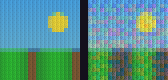

# Mosaic

Mosaic is an Android app that builds a photographic mosaic from your own pictures. The matching engine is pure Kotlin in the `:engine` module, so the algorithm, tests, and benchmarks run on a normal JVM. The Android app handles the camera, gallery, project library, and on-device subject segmentation.

## Architecture

```
:engine   color, descriptors, index, matcher, renderer, coordinator
:app      Compose UI, Room, Keystore, bitmap decode, ML Kit
```

Generation is coordinated by `GenerationCoordinator` and runs in this order:

1. Loading
2. Analyzing
3. Indexing
4. Matching
5. Rendering
6. Saving
7. Complete

Progress events are throttled by time. Cancel stops the coroutine between tiles and cells. Preview and the full render use the same matcher and the same seed. They differ by output resolution. A full render can reuse the preview's tile plan when the target, library, and matching settings are unchanged.

Full-resolution output is written scanline by scanline with `StreamingPngWriter`. The image is never one giant bitmap, and the manifest does not set `android:largeHeap`.

## Matching

Each tile is described once and cached. A descriptor stores:

- OKLab color, luminance, and saturation
- a 4×4×4 OKLab histogram
- a 4×4 spatial OKLab grid
- edge density
- alpha coverage and aspect ratio

The cache key is the URI, pixel size, byte size, modified time, and algorithm version. Adding or removing one photo does not rebuild the other descriptors.

Tiles are placed in an 8×8×8 OKLab bin index. For each target cell the matcher asks for a small candidate set: nearby bins first, then a luminance window, skipping bins that cannot beat the current best. Repetition radius and a per-cell probe budget bound the search. A 5,000-tile library does not compare every tile with every cell.

The score is a weighted sum of color, luminance, histogram, spatial, and edge distance, plus a soft usage penalty. Equal scores break with a deterministic seed. If every legal tile is excluded by the repetition radius, the cell is left as the target color. The matcher does not fall back to a tile inside the exclusion zone.

## Tile preparation

Photos are not stretched into squares. The default is a center crop that keeps the source aspect inside the cell. Fit-inside letterboxes the tile instead. Mostly transparent pixels do not contribute a strong color.

## Quality presets

Advanced controls stay available. Choosing a preset fills them in:

| Preset | Grid | Descriptor edge | Candidates | Output | Render |
| --- | ---: | ---: | ---: | --- | --- |
| Draft | 24×24 | 16 px | 8 | Standard (24 px cells) | Blended |
| Balanced | 40×40 | 24 px | 16 | Standard | Color corrected |
| High Quality | 64×64 | 32 px | 32 | High (40 px cells) | Color corrected |
| Maximum | 100×100 | 48 px | 48 | Ultra (64 px cells) | Color corrected |

Output modes are Standard, High, and Ultra. Render modes are Original, Color corrected, and Blended. Color correction shifts each tile toward the cell in OKLab. Blending mixes that correction with the original tile. The old flat translucent rectangle is gone.

A few hundred distinct photos is enough for a balanced grid. More than about a thousand helps Maximum grids and repetition. Very small libraries will repeat, which the radius then spreads out.

## Performance

Measured with `./gradlew :engine:benchmark` on this machine (OpenJDK 21, synthetic unique-hue tiles, 16 px analysis thumbnails, 12 px render cells, one discarded warmup pass). Heap is `totalMemory - freeMemory` around the case and is only an estimate. The full table is in [docs/benchmarks/results.md](docs/benchmarks/results.md).

| Tiles | Grid | Analyze ms | Index ms | Match ms | Render ms | Total ms | Probes | Full scan | Heap MB |
| ---: | --- | ---: | ---: | ---: | ---: | ---: | ---: | ---: | ---: |
| 100 | 40×40 | 9.6 | 0.3 | 75.0 | 60.8 | 146.9 | 84,182 | 160,000 | 0.6 |
| 500 | 60×60 | 11.2 | 0.5 | 38.0 | 101.3 | 153.3 | 233,398 | 1,800,000 | 1.8 |
| 1,000 | 80×80 | 23.2 | 0.9 | 67.3 | 199.8 | 295.3 | 416,000 | 6,400,000 | 3.9 |
| 5,000 | 120×120 | 110.8 | 2.8 | 154.6 | 427.0 | 709.0 | 936,000 | 72,000,000 | 13.0 |

"Full scan" is cells × tiles, which is what the 1.x matcher did. At 5,000 tiles the index probes about 1.3% of that. Matching 14,400 cells against 5,000 tiles took 155 ms in this run.

The same scene rendered with the 1.x average-RGB matcher (left) and the OKLab matcher (right):



The left image repeats the same tiles in blocks. The right image spreads tiles and follows the scene color more closely.

## AI segmentation

Subject extraction uses on-device ML Kit. It does not upload photos. Automatic extraction, when enabled, adds cutouts beside the original photos. It does not replace them. Limits:

- maximum number of extracted subjects
- minimum subject size
- shape categories (tall, wide, compact)
- deduplication
- a cap so cutouts stay a fraction of the normal library

The Stamps tab still extracts subjects from a picked photo into their own pool, with the same size and duplicate filters and a higher cap.

## Privacy and API keys

There is no developer API key in the app. An optional key you type is encrypted with an Android Keystore master key (`EncryptedSharedPreferences`) and stays on the device. If the keystore cannot be opened, the key is not written to plain preferences. A key left in the old plaintext setting is copied into encrypted storage and then removed.

This version does not send that key anywhere. Segmentation is on-device. The field is kept so a key you already saved is still available and is no longer stored in plaintext.

## Projects

Project metadata lives in Room (`mosaic.db`). Image files stay in app storage. Writes go to a temporary file, are flushed, then renamed. On launch, a missing preview or full image is marked on the project, and files that no longer belong to a project are deleted. An existing `library_index.json` is imported once and renamed to `library_index.json.migrated`.

## Build

Requirements: JDK 17, Android SDK 36.

```bash
./gradlew :engine:test
./gradlew :engine:benchmark
./gradlew :app:assembleDebug
./gradlew :app:assembleRelease
./gradlew :app:bundleRelease
```

Debug output: `app/build/outputs/apk/debug/app-debug.apk`

Without `keystore.properties`, release packaging still succeeds and produces an unsigned APK (`app-release-unsigned.apk`) and an unsigned AAB. To sign a release, create a gitignored `keystore.properties`:

```properties
storeFile=release.jks
storePassword=
keyAlias=
keyPassword=
```

Do not commit that file or the keystore.

## Testing

JVM tests cover OKLab conversion, histograms, cropping, descriptors, candidate indexing, repetition, usage balance, grid planning, empty libraries, small and large images, transparent images, cancellation, atomic writes, and a golden image. The golden digest is SHA-256 `3393612eae7c7cef5cdeb54f04c12f47ebff9ea9e22c882feb1f905268b1c34c`.

```bash
./gradlew :engine:test :engine:detekt :app:detekt :app:lintDebug
```

`ProjectDaoTest` is an instrumented Room test. CI runs it on an API 29 emulator. It needs a device or emulator locally:

```bash
./gradlew :app:connectedDebugAndroidTest
```

## Release procedure

GitHub Actions (`.github/workflows/ci.yml`) runs engine tests, detekt, benchmarks, Android lint, debug and release packages, and the instrumented test. Release signing uses these repository secrets when they are present:

- `KEYSTORE_BASE64`
- `STORE_PASSWORD`
- `KEY_ALIAS`
- `KEY_PASSWORD`

If `KEYSTORE_BASE64` is empty, the workflow logs that and still builds unsigned artifacts. Upload the AAB to Play Console from a machine that has the real upload key. This repository does not contain one.

## Known limitations

- Photo picker batches are capped at 100 images by the system picker contract. Add more in further picks.
- Ultra output is a large PNG. The renderer streams it, but the device still needs enough free storage. The app checks free space before a full render and refuses when the estimate plus an 8 MB reserve does not fit.
- Descriptor modified time is whatever the content provider reports. Providers that omit it fall back to file size, so a same-size replacement may reuse a cached descriptor until the photo is removed and added again.
- ML Kit subject segmentation needs the Play services model. The first extraction can fail until that model is available. The app keeps the original photos either way.
- Benchmark heap figures move around with the garbage collector. Use the probe counts and stage times for comparisons.
- Process death, a real low-memory device, and Play Console signing were not exercised in the automated JVM run. Projects are reloaded from Room on startup, and generation is cancelled by cancelling the coroutine job.
