# Mosaic

Mosaic is an Android app that builds a photographic mosaic from your own pictures. The matching engine is pure Kotlin in the `:engine` module, so the algorithm, tests, and benchmarks run on a normal JVM. The Android app handles the camera, gallery, project library, and on-device subject segmentation.

## Architecture

```
:engine   color, descriptors, index, matcher, renderer, coordinator
:app      Compose UI, Room, Keystore, bitmap decode, ML Kit
```

Generation is coordinated by `GenerationCoordinator` and runs in this order:

1. Loading
2. Analyzing
3. Indexing
4. Matching
5. Rendering
6. Saving
7. Complete

Progress events are throttled by time. Cancel stops the coroutine between tiles and cells. Preview and the full render use the same matcher and the same seed. They differ by output resolution. A full render can reuse the preview's tile plan when the target, library, and matching settings are unchanged.

Full-resolution output is written scanline by scanline with `StreamingPngWriter`. The image is never one giant bitmap, and the manifest does not set `android:largeHeap`.

## Matching

Each tile is described once and cached. A descriptor stores:

- OKLab color, luminance, and saturation
- a 4×4×4 OKLab histogram
- a 4×4 spatial OKLab grid
- edge density
- alpha coverage and aspect ratio

The cache key is the URI, pixel size, byte size, modified time, and algorithm version. Adding or removing one photo does not rebuild the other descriptors.

Tiles are placed in an 8×8×8 OKLab bin index. For each target cell the matcher asks for a small candidate set: nearby bins first, then a luminance window, skipping bins that cannot beat the current best. Repetition radius and a per-cell probe budget bound the search. A 5,000-tile library does not compare every tile with every cell.

The default score is mostly OKLab color (0.78), with smaller luminance, histogram, spatial, and edge terms. A usage penalty exists, but its unit is `0.0005` per previous use and the default weight is 0, so it does not override a better color. Copies of one source may be flipped, rotated, and resized, and the same source may be used many times. A copy must never touch another copy of that source, including a diagonal neighbor. Repeat spacing stores a Chebyshev radius. Zero still enforces a one-cell gap. A larger radius keeps copies farther apart. If every legal tile would touch an existing copy, the cell is left as the target color. The matcher does not place a tile inside that exclusion zone. A rectangle that covers several cells is one copy: the ban compares anchors, so the cells inside one placement are allowed to share it. Equal scores break with a deterministic seed.

## Tile preparation

Photos are not stretched into squares. The default is a center crop that keeps the source aspect inside the cell. Fit-inside letterboxes the tile instead. Mostly transparent pixels do not contribute a strong color.

## Non-square cells, rotation, and size

Uniform cells that follow the grid are still the default, and center-crop and fit-inside still work. Extra controls sit beside that:

- **Cell shape.** Match grid keeps the previous row math. Square, 4:3, 3:2, 16:9, and the portrait pairs set the cell aspect when rows are linked to the grid. Sampling cells and output cells share that aspect, so a tile is cropped or fitted into a rectangle instead of a square.
- **Mixed shapes.** The grid is packed with 1×1, 2×1, and 1×2 rectangles. A landscape photo can occupy a wide cell and a portrait photo a tall one. Every unit cell belongs to exactly one rectangle, so the mosaic has no gaps or overlaps. The seed makes preview and the full render pack the same way. Mixed layout does not shift rows like staggered bricks. Mixed layout does not subdivide for edges.
- **Edge cells.** A uniform grid doubles its columns and rows along the target's outlines, capped at 200 and at the target size, then keeps a flat 2×2 block as one cell. A coarse block splits into four cells when its luma range, or the jump to a neighbor, is above 0.11. Staggered bricks stay on the base grid. Output cell pixels are halved when the grid doubles, so the picture stays about the same size. `subdivideEdges` defaults on.
- **Automatic rotation.** Off leaves every tile upright. Match orientation tries 90° and 270° only when the tile aspect and the cell aspect disagree, so a portrait photo can fill a landscape cell. Full also tries 180° and a mirror. Each variant reuses the cached descriptor and only rotates the 4×4 spatial grid, so the photo is not decoded again per angle. Repetition and the usage penalty count the source photo, not each rotated copy.
- **Manual rotation.** The target has a rotate button (90° steps). Each library tile has one too. Target turns and the per-tile turns are stored in settings and on the Room project. A manual tile turn is part of the cache key (`uri#qN`).
- **Size.** A target scale from 25% to 100% is applied before matching. Full-render width and height can be custom; blank fields keep the Standard, High, or Ultra preset. Lock aspect derives the height from the rotated target. Each edge must be 0 or from 64 to 8192. A cell cannot exceed 512 pixels on a side, and the image cannot exceed 24 million pixels. Output above 2.5 million pixels is streamed to a PNG instead of one bitmap. The screen states the limit when a size is rejected. Custom output size does not change which tile is chosen, so preview and final still share a plan.

## Cutout collage

Grid mosaics are still the default. Cutout collage is a separate mode. It rebuilds the target out of paper shapes cut from the source images. A piece follows a region of the target: a coat, a face, a hair edge, an eye line. It is not a rectangle of a still dropped next to other rectangles. Pieces overlap. Large shapes go down first and block in the regions. Smaller shapes and contour strokes land later and can cover what is already there.

The target is analyzed with its long edge capped at 360. The first shapes are a coarse partition of the flat areas, then smaller cuts across the picture, then contour strokes on the darker side of a luminance edge. Of the requested piece count, the coarse layer is about 4% and at most 48 shapes, and only where the target is actually flat. Neighboring flat cells with close OKLab means merge, but a merged piece cannot grow past 45% of the short side, so a face or a sky does not become one canvas-sized blob. The edge layer is about 12% and at most 280 shapes. The rest of the budget is small detail, and those cuts stay even where a flat piece already covers the same pixels. Color is measured on the undilated core, so a thin dark line is not averaged with the field around it. Those shapes are painted onto a working OKLab canvas as they are chosen. A later pass samples the worst remaining error, after a blur raised to the fourth power and weighted by the target's edge energy and by skin-like color, so faces, eyes, hair, and headbands get more of the small pieces. It commits another piece only when that piece lowers the error on its own pixels. A short pass can drop a residual piece that does not help, or swap its source for one that does. A detail cut that was requested is not dropped. Each source can contribute a handful of neighboring pieces from one part of its photo. A later piece from that same photo, somewhere else in the collage, costs more, so neighboring shapes are not all the same few pictures. When repetition is allowed, the same source may be used many times. A flip, a rotation, or a resize still counts as that source. After compositing, the visible region of one copy must not share a boundary with, or overlap, another copy of that source. A candidate that would touch is skipped. The next legal candidate is used when its score stays within 0.12 of the best offer, including offers the contact rule rejected. A much worse legal tile is not placed, and that shape is left for a later piece. Turning repetition off still uses each source once. Regenerating a region treats pieces outside the hole as reserved, so a new piece cannot touch a copy that sits just outside the edit. Growing a mask to mend a seam is rejected when the growth would touch another copy, and the previous mask stays. The mask is grown by the overlap setting and stored as a binary mask, so the feather does not bleed into the photo. The drawn edge is traced and corner-cut, then filled with scanline coverage at output resolution. If that outline does not close, the bitmap mask is used.

The engine does not search every source for every shape. Each shape asks the OKLab index for a short candidate list, then scores only that list. When color correction is on, that score solves a clamped per-channel gain and offset and adds a penalty, so the winner is the source that will be closest after the allowed shift, not the raw crop. A flat blocking shape, about 5.5% of the short side or larger and with little internal contrast, looks for a calm crop: upright, a small window, and a short span. The texture penalty on that crop is light (spread × 1.2). A busy shape, including a face, scores spatial samples, prefers a crop that contains the source's salient subject and a patch with real internal contrast, and then slides the crop by 0.05 and 0.10. The crop span follows the piece's size on the output: native is that size divided by the source's long edge, and the source is not enlarged by more than about 1.25×. After that coarse pick, a 16×16 phase correlation shifts the crop toward the translation where the source patch lines up with the cut. Fourier magnitudes of the cut outline and of the source's salient blob add a small cost, scaled by the shape weight, so a silhouette that already fits is preferred. Shape weight 0 adds nothing. Cutout pieces stay upright. Faces are detected once per source and cached: a cartoon and anime detector in the engine, or boxes supplied by the device (ML Kit on photographs). A source with no face is excluded. After the color search, the crop shifts just enough to keep one detected face inside the window, and the window grows when that face would otherwise be larger than the piece can show at about 1.25×. A later piece may cover at most about a third of an earlier face, and a piece whose face is no longer mostly visible is dropped and the gap is filled again. The seed only jitters ties. A rejected swap does not count as a use of that source. Preview and the full render share the plan. Output size is not part of it.

A shaped piece is filled from the source region that won, not from the whole cutout. Sources are sampled from a thumbnail whose long edge is 768, so a typical 512-pixel frame stays at its own resolution and is never a small thumb stretched across the piece. Transparent texels are filled from the nearest opaque source color first, so a cleared background does not punch a hole, and the sample is bilinear at about that native scale. Later shapes overwrite earlier ones. There is no rectangular border. A saved placement that has no mask still uses the older stamp path, which alpha-composites the cutout and only replaces a pixel when the new color is closer to the target.

While pieces land, the coordinator renders a small preview twice: after the large shapes, and again after the edge shapes. The progress label changes with the stage. Cancel still stops the loop. The full export is the same chunked scanline renderer as the grid.

What a descriptor stores for a cutout, in addition to the usual OKLab color, histogram, and spatial grid:

- those color features are computed only on pixels with alpha above 40
- an 8×8 alpha mask of the opaque bounds
- the opaque bounds as fractions of the source, so a stamp rotation does not need another decode

The shaped matcher builds a 12×12 OKLab swatch from the opaque pixels inside those bounds. Repetition and the usage penalty count the source image, not each crop or angle.

Rendering writes scanlines. The default background is the target's mean color, not the target photo. The target photo is still available as an explicit background if you want it under any gap. When color correction is on, the sharp source pixel stays, and a smooth grade moves it toward a 64-pixel-wide average of the target. The grade is strength × 0.9 of the gap between that average and a low-frequency base (the source area-averaged to 40 pixels on the long edge, or one eighth of the source when that is smaller), clamped to ±0.18 in lightness and ±0.10 in chroma, so the photo remains readable and the thumbnail still takes the target's color. The source pixels are not blurred into the output. Strength 0 leaves the pixel unchanged. The published synthetic sample leaves correction off, so the source colors have to rebuild the picture. The showcases use color-corrected mode at strength 0.72 and leave Separate pieces off, which matches the Dense style and the app default. Large pieces, about 5.5% of the short side or larger, take 1.4× that grade, capped at 1. When Separate pieces is on, or the style is torn paper, each shape has a light off-white rim, alpha 84–108 and at most 2 pixels on a 1680-wide picture, and a short drop shadow. Stamp placements still use the older dark offset when separate pieces is on. An outline pass, `preserveTargetEdges`, defaults on. It darkens along the target's detected line art, up to 0.34 in lightness above a floor of 56, and leaves chroma and the source texture in place. Cutout pieces stay upright. Gradient-orientation matching and edge-snapped cut contours are not in this build.

A final collage is scaled so its long edge is at least 1600 px on Standard, 2200 on High, and 2800 on Ultra, then clamped to 24 million pixels. Preview and a custom width or height skip that floor. Output above 2.5 million pixels is streamed to a PNG. A size that would break the cell or pixel cap is rejected with the limit on screen. There is no `android:largeHeap`.

Limits: 4 to 4,000 placements, scale from 1.5% to 90% of the target's short side, rotation from 0° to ±180°. The default asks for 480 pieces, from 3% to 16% of the short side. A piece whose visible short side, after the mask and later overlaps, is under the minimum is not kept: that region is merged into a neighbor or covered by a larger piece. The default minimum is 4.5% of the short side (about 62 px on a 1380 px side), the visible area must cover at least 62% of that square, and the Studio slider runs from 2.5% to 12%. The coarse shapes cover the picture, and the rest of the budget is smaller edge shapes. Quality presets set the collage budget, scale range, and correction strength along with the grid knobs. A style then sets overlap, rotation, and color. Advanced sliders stay behind an Advanced section. Collage mode uses the cutout pool and automatic extraction. Full photos are included only when you turn that on, or when no cutout could be loaded. After a mask is cropped, alpha below 24 is dropped, enclosed holes are filled from the nearest opaque color, specks smaller than 24 pixels are removed, and the outer edge is softened. On the stamp itself, Trim raises the alpha cutoff and crops to the remaining subject. Edit can erase with a finger and apply that soft edge again. The refined mask is stored with the pool. You can add many photos at once; extraction reports progress and can be cancelled. ML Kit still has no person or object labels, and it still needs the on-device model.

## Quality presets

Advanced controls stay available. Choosing a preset fills them in:

| Preset | Grid | Descriptor edge | Candidates | Output | Render | Collage pieces | Collage scale | Adjustments |
| --- | ---: | ---: | ---: | --- | --- | ---: | --- | ---: |
| Draft | 24×24 | 16 px | 8 | Standard (24 px cells) | Blended | 180 | 5–22% | 0 |
| Balanced | 40×40 | 24 px | 16 | Standard | Color corrected | 480 | 3–16% | 8 |
| High Quality | 64×64 | 32 px | 32 | High (40 px cells) | Color corrected | 1,200 | 2–11% | 14 |
| Maximum | 100×100 | 48 px | 48 | Ultra (64 px cells) | Color corrected | 2,200 | 1.5–8% | 20 |

Output modes are Standard, High, and Ultra. Render modes are Original, Color corrected, and Blended. Grid color correction shifts each tile toward the cell in OKLab. Collage correction applies that bounded grade and keeps the source photo. Blending uses the same split at a lower strength. The old flat translucent rectangle is gone. Correction strength is 0.45, 0.65, 0.75, and 0.85 for the four presets.

Draft and Balanced leave the usage penalty at 0. High Quality and Maximum add a light penalty (0.15 and 0.30) so repeated near-matches rotate a little. A few hundred distinct photos is enough for a balanced grid. More than about a thousand helps Maximum grids. A small library still repeats. Copies of one photo must not touch, including corners. The Repeat spacing slider shows at least 1 cell.

## Performance

Measured with `./gradlew :engine:benchmark` on this machine (OpenJDK 21, synthetic unique-hue tiles, 16 px analysis thumbnails, 12 px render cells, one discarded warmup pass). Heap is `totalMemory - freeMemory` around the case and is only an estimate. The full table is in [docs/benchmarks/results.md](docs/benchmarks/results.md).

| Tiles | Grid | Analyze ms | Index ms | Match ms | Render ms | Total ms | Probes | Full scan | Heap MB |
| ---: | --- | ---: | ---: | ---: | ---: | ---: | ---: | ---: | ---: |
| 100 | 40×40 | 4.6 | 0.2 | 47.8 | 49.1 | 103.0 | 84,135 | 160,000 | 0.6 |
| 500 | 60×60 | 49.2 | 0.4 | 39.5 | 109.3 | 200.7 | 233,676 | 1,800,000 | 1.9 |
| 1,000 | 80×80 | 23.1 | 0.7 | 64.5 | 193.3 | 285.9 | 415,996 | 6,400,000 | 4.1 |
| 5,000 | 120×120 | 115.3 | 2.6 | 141.8 | 435.6 | 708.6 | 936,000 | 72,000,000 | 13.5 |

"Full scan" is cells × tiles, which is what the 1.x matcher did. At 5,000 tiles the index probes about 1.3% of that. Matching 14,400 cells against 5,000 tiles took 141.8 ms in this run. Probe counts match the previous grid run.

A separate 500-tile case uses 16:9 cells and orientation matching (250 landscape tiles, 250 portrait). The grid is 40×40. Match took 44.8 ms and 103,890 probes against a full scan of 800,000. Total time was 158.8 ms. Probes stay on the source photos; rotated copies are scored from the cached spatial grid. Probe counts match the previous grid run. The grid golden moved in 2.1.0: uniform grids subdivide along edges, copies of one source cannot touch, and a light outline ink follows the target line art.

Cutout collage, after a discarded warmup, on a 160×100 gradient. The coarse pass is a full partition, so coverage is 100% even when the piece budget asks for more regions than the scale step can cut. Probes stay far below a full scan. The 900-piece row uses the same scale range as the smaller rows.

| Cutouts | Requested | Placed | Match ms | Render ms | Total ms | Probes | Full scan | Painted |
| ---: | ---: | ---: | ---: | ---: | ---: | ---: | ---: | ---: |
| 200 | 160 | 154 | 449.6 | 20.4 | 474.6 | 13,151 | 384,000 | 100% |
| 600 | 280 | 240 | 489.7 | 16.4 | 517.4 | 25,228 | 2,016,000 | 100% |
| 400 | 900 | 283 | 1,119.4 | 16.0 | 1,142.8 | 73,437 | 4,320,000 | 100% |

A hybrid case on the same gradient, 200 cutouts, 160 requested pieces, and a 20×12 grid under the collage, took 410.2 ms and 22,778 probes. It placed 155 shapes.

Full scan is requested pieces × cutouts × 12 angles. The portrait sample uses 240 cutouts and 320 requested pieces, seed 4, on a flat mean-color background, locked to 280×180 so it lines up with the previous residual file. Correction is off. The shaped run placed 279 pieces and painted 97% of the pixels. The minimum piece size keeps that count below the request when the budget would otherwise stamp slivers. The stamp row is the previous placer on this same portrait. Its edge-alignment figure used the edge pixel itself, and its distance scores were not stored. The previous shaped row is the run before flat crops and tone transfer. Its distance was not stored either. The shaped figure is the mean target-edge strength within two pixels of a piece boundary, divided by the picture average. Above 1 means the cuts follow edges. Distance ΔE and distance SSIM compare both images after area-averaging to 64 pixels wide.

| | Whole ΔE | Whole SSIM | Masked ΔE | Masked SSIM | Edge ΔE | Painted | Alignment | Distance ΔE | Distance SSIM |
| --- | ---: | ---: | ---: | ---: | ---: | ---: | ---: | ---: | ---: |
| Underlayer sample | 0.0475 | 0.7655 | 0.0989 | 0.6873 | — | 59% | — | — | — |
| Previous residual | 0.0334 | 0.6746 | 0.0477 | 0.6779 | 0.0563 | 96% | — | 0.0444 | 0.8026 |
| Stamp collage | 0.0323 | 0.7045 | 0.0447 | 0.7061 | 0.0527 | 94% | 3.211 | — | — |
| Previous shaped | 0.0341 | 0.7417 | 0.0488 | 0.7417 | 0.0556 | 100% | 10.4693 | — | — |
| Shaped collage | 0.0422 | 0.6960 | 0.0585 | 0.6965 | 0.0672 | 97% | 10.8283 | 0.0550 | 0.7096 |
| Photo textures | 0.0577 | 0.6724 | 0.0829 | 0.6747 | 0.0904 | 97% | 10.6809 | 0.0773 | 0.6073 |

| | Whole ΔE | Whole SSIM | Masked ΔE | Masked SSIM | Edge ΔE | Painted | Alignment | Distance ΔE | Distance SSIM | Generate ms |
| --- | ---: | ---: | ---: | ---: | ---: | ---: | ---: | ---: | ---: | ---: |
| Color only | 0.0419 | 0.7094 | 0.0566 | 0.7100 | 0.0652 | 97% | 10.7203 | 0.0530 | 0.7423 | 1,197 |
| Shape-aware | 0.0418 | 0.6989 | 0.0578 | 0.6982 | 0.0659 | 97% | 10.7502 | 0.0539 | 0.7199 | 1,204 |
| Dense 1,200 | 0.0478 | 0.6763 | 0.0659 | 0.6768 | 0.0652 | 95% | 12.3516 | 0.0606 | 0.6586 | 2,210 |
| Grid under collage | 0.0399 | 0.7019 | 0.0580 | 0.7060 | 0.0668 | 97% | 10.8283 | 0.0525 | 0.7260 | 1,204 |
| Collage under grid | 0.0219 | 0.3637 | 0.0357 | 0.3299 | 0.0399 | 16% | 10.8283 | 0.0358 | 0.7940 | 1,200 |

Masked scores count only pixels a cutout painted. Edge ΔE is the mean OKLab distance on the covered pixels whose reference luminance gradient is in the top quarter. On this correction-off portrait, whole ΔE is 0.0422, masked ΔE is 0.0585, luminance SSIM is 0.6960, and distance SSIM is 0.7096 at a distance ΔE of 0.0550. Coverage is 97%. The dense run asks for 1,200 pieces at the High Quality scale range on a 560×360 canvas: whole ΔE 0.0478, SSIM 0.6763, distance ΔE 0.0606, distance SSIM 0.6586, coverage 95%. The minimum piece size is why that dense run no longer reaches 1,200 stamps. Shape weight now changes the score. The shape-aware row pays a Fourier penalty the color-only row does not, so the numbers differ. Both still cut the same target shapes. Collage-under-grid paints the grid over the shapes except for a grout gap, so its masked coverage is the grout (16%) and its whole-image SSIM follows the grid.

On the 280×180 face, against the frozen previous residual file: left eye 37.1 → 25.8, right eye 45.1 → 21.6, mouth 18.8 → 20.0, cheek 16.2 → 14.8. Correction is off in this sample, so a small window still picks up source texture. The eyes and the cheek are closer than the residual. The mouth is slightly farther.

Those scores are the synthetic portrait the benchmark measures, with correction off. The showcases below use color-corrected mode at strength 0.72. Distance readability area-averages both images to 64 pixels wide. Texture is high-frequency energy, the mean absolute OKLab luminance deviation from a 3×3 box, divided by the same measure on the target. That ratio stays near 1 when a sharp photo and a smeared thumb have similar energy, so it does not say whether a source frame is still recognizable. Piece fidelity does. For each placed piece it compares the rendered pixels to the sharp, ungraded source crop at that crop's own size, using the SSIM contrast and structure terms, and reports the median and the 10th percentile. A smooth grade does not count as lost detail. A blur or an upscale does. The closed-loop row is the previous committed collage. Kept is the engine gate: high-frequency energy of the color-corrected render divided by the same plan rendered with correction off.

| | Naruto ΔE | SSIM | Texture | Dense ΔE | SSIM | Texture | Rick ΔE | SSIM | Texture | Rick dense ΔE | SSIM | Texture |
| --- | ---: | ---: | ---: | ---: | ---: | ---: | ---: | ---: | ---: | ---: | ---: | ---: |
| Stamp collage | 0.1231 | 0.5617 | 2.89 | 0.1268 | 0.5373 | 3.37 | 0.1003 | 0.5753 | 2.88 | 0.1080 | 0.5249 | 2.77 |
| Previous shaped | 0.1336 | 0.4906 | 1.36 | 0.1154 | 0.5976 | 1.70 | 0.0831 | 0.6654 | 1.46 | 0.0953 | 0.6198 | 1.78 |
| Flat crops | 0.0852 | 0.7495 | 0.19 | 0.0852 | 0.7615 | 0.20 | 0.0775 | 0.7053 | 0.19 | 0.0767 | 0.6857 | 0.21 |
| Closed loop | 0.0801 | 0.7908 | 0.26 | 0.0800 | 0.7889 | 0.27 | 0.0804 | 0.6521 | 0.19 | 0.0802 | 0.6591 | 0.18 |
| Paper detail | 0.0873 | 0.7757 | 1.03 | 0.0868 | 0.7765 | 1.02 | 0.0766 | 0.7252 | 0.53 | 0.0767 | 0.7300 | 0.53 |
| Cut paper | 0.1152 | 0.6844 | 1.00 | 0.1133 | 0.6952 | 0.99 | 0.0917 | 0.6542 | 0.53 | 0.0925 | 0.6553 | 0.52 |
| Small pieces | 0.1091 | 0.7037 | — | 0.1273 | 0.6413 | — | 0.0621 | 0.7694 | — | 0.0640 | 0.7750 | — |
| Minimum piece | 0.1083 | 0.6378 | 1.02 | 0.1081 | 0.6369 | 1.02 | 0.0775 | 0.6068 | 0.94 | 0.0776 | 0.6049 | 0.94 |

The paper-detail row kept line art and graded each piece most of the way to the target, so the thumbnail was tight and the photos were hard to recognize. Cut paper keeps the sharp photo and applies the bounded grade, but the pieces were large and the source frames were sampled from a 128-pixel thumb, so the texture column could read 1.00 while the photos were still a smear. Small pieces asks for 1,800 shapes (1,807 placed) at 1.2–5% scale, and 3,400 (3,403 placed) for the dense row at 0.8–3%. Each piece is a near-native crop, never upscaled more than about 1.25×, and the color grade is unchanged. Naruto's distance moves from 0.1152 to 0.1091 and its SSIM from 0.6844 to 0.7037. The dense Naruto distance moves from 0.1133 to 0.1273. Rick's distance moves from 0.0917 to 0.0621 and its SSIM from 0.6542 to 0.7694. Dense Rick moves from 0.0925 to 0.0640. The texture column is left blank because high-frequency energy versus the target was not recomputed; it is the metric that stayed near 1.00 on the smeared cut-paper render. The kept ratio is 1.040 for Naruto, 1.048 dense, 0.942 for Rick, and 0.928 dense. Piece fidelity, median and 10th percentile, is 0.536 and 0.172 for Naruto, 0.498 and 0.134 dense, 0.688 and 0.320 for Rick, and 0.617 and 0.179 dense. A blocking layer made only of global color masses was tried earlier and discarded. The minimum-piece row is the same request with a hard floor of 4.5% of the short side, measured on what remains visible after the mask and later overlaps. Naruto places 324 pieces in both the normal and dense renders. Rick places 374. Piece fidelity, median and 10th percentile, is 0.620 and 0.350 for Naruto, 0.633 and 0.350 dense, 0.725 and 0.416 for Rick, and 0.724 and 0.417 dense. The smallest visible short side is 4.57% for Naruto and 4.55% for Rick.

The pictures below are separate showcases. `scripts/regenerate-showcase.py all` rebuilds every theme. A single name rebuilds one: `naruto`, `rick`, `tmnt`, `koth`, or `pokemon`. Sources download into the gitignored `showcase-sources/` folder. The source stills are not in the repository. They belong to their respective owners. These showcases are a non-commercial demonstration. The images in this README update on `master` when [pull request 14](https://github.com/Intrusive-Thots/Mosaic/pull/14) merges. Until then, the newest renders live on that pull request.

Every franchise is both a target and a library. Team 7 is rebuilt from Rick and Morty stills. The Smiths are rebuilt from TMNT. The turtles are rebuilt from Naruto. Hank, Dale, Bill, and Boomhauer are rebuilt from Pokemon. Ash and Pikachu are rebuilt from King of the Hill. The URL lists are [docs/showcase/sources.tsv](docs/showcase/sources.tsv), [docs/showcase/rick-sources.tsv](docs/showcase/rick-sources.tsv), [docs/showcase/tmnt-sources.tsv](docs/showcase/tmnt-sources.tsv), [docs/showcase/koth-sources.tsv](docs/showcase/koth-sources.tsv), and [docs/showcase/pokemon-sources.tsv](docs/showcase/pokemon-sources.tsv). A flat border is flooded away. A character that already fills a clear frame stays. A transparent target, such as the TMNT group render, is composited on white before matching. Every placed piece is at least 4.5% of the short side and keeps a detected face from its source. The collage seed is 4 and the grid seed is 7. Color correction is 0.72 on the collage and 0.58 on the grid. Separate pieces is off.

These full-size numbers are the 2.1.0 engine. On the Pokemon library, 100 cutouts remain and 96 have a face, so 4 are excluded. The King of the Hill collage places 374 pieces, all of them on a face. Distance ΔE is 0.0954, SSIM 0.366, texture 0.936. Piece fidelity median is 0.835 and the 10th percentile is 0.735. The smallest visible short side is 4.56% of the short side, against a 4.5% floor. The dense pass places 384 pieces, ΔE 0.0974, SSIM 0.364, texture 0.936, fidelity 0.832 and 0.739. The picture is 1468×1633 because the alley still is portrait and the in-memory bitmap stays under 2.4 million pixels.

On the King of the Hill library, 97 cutouts remain and 94 have a face, so 3 are excluded. The Ash and Pikachu collage places 525 pieces, all of them on a face. Distance ΔE is 0.0954, SSIM 0.602, texture 0.906. Piece fidelity median is 0.789 and the 10th percentile is 0.661. The smallest visible short side is 4.55%. The dense pass places 527 pieces, ΔE 0.0975, SSIM 0.588, texture 0.904, fidelity 0.794 and 0.641. The picture is 1680×945.

On the Naruto library, 99 cutouts remain and 94 have a face, so 5 are excluded. The turtles, composited on white, place 386 pieces. Distance ΔE is 0.133, SSIM 0.461, texture 0.901. Piece fidelity median is 0.893 and the 10th percentile is 0.736. The smallest visible short side on the normal pass is 4.56%. The dense pass places 405 pieces, ΔE 0.138, SSIM 0.455, fidelity 0.899 and 0.730.

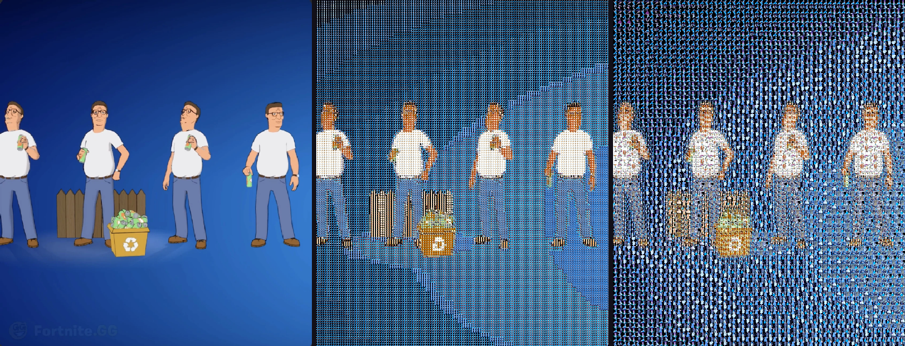

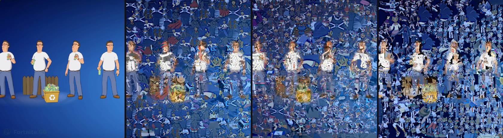

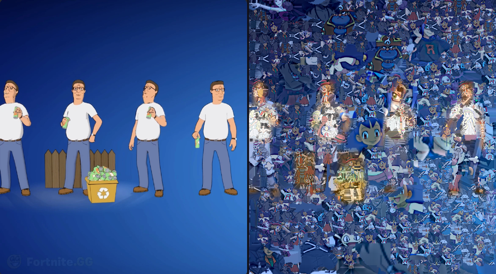

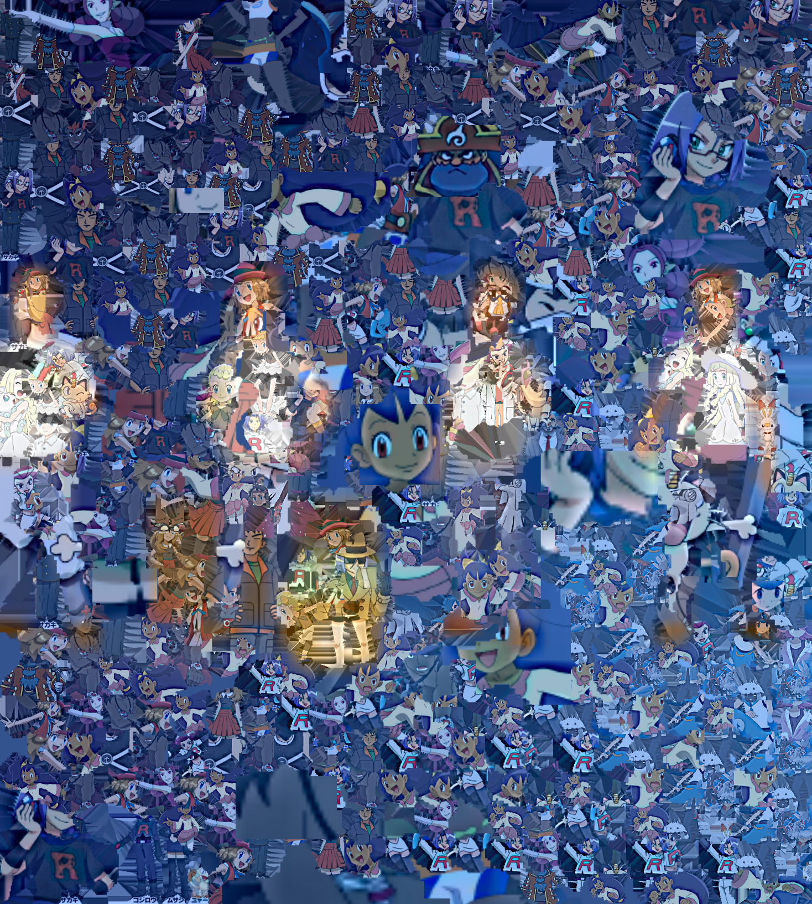

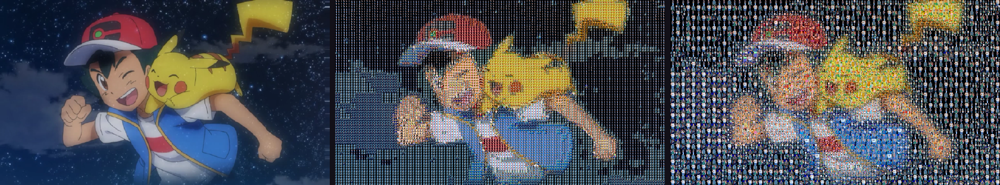

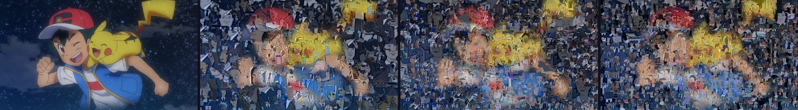

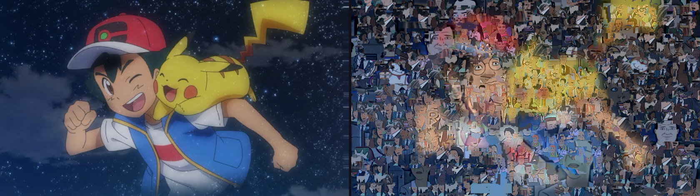

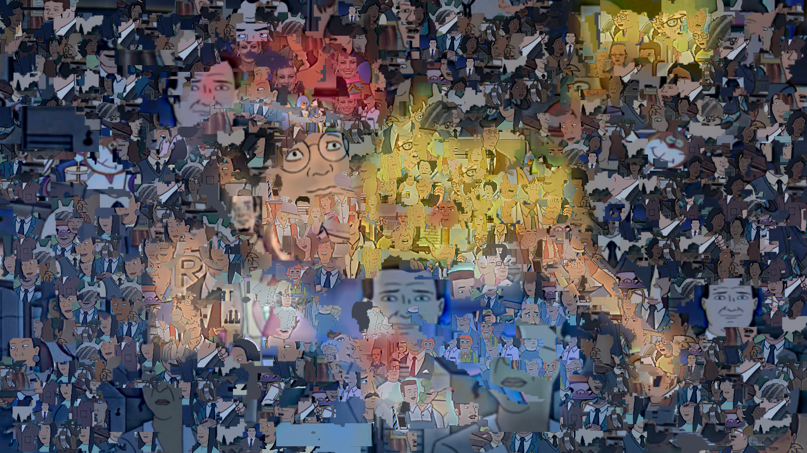

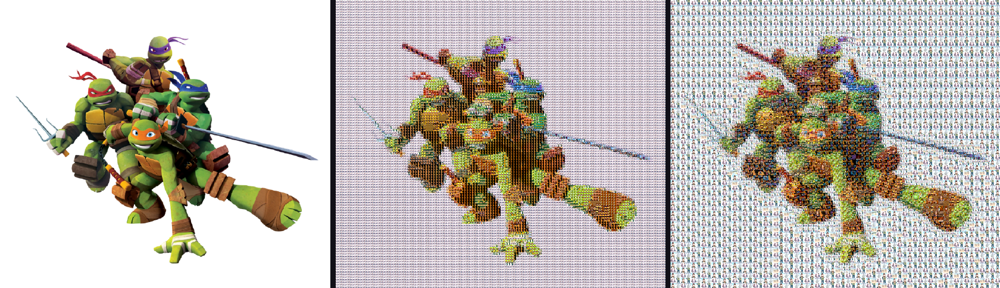

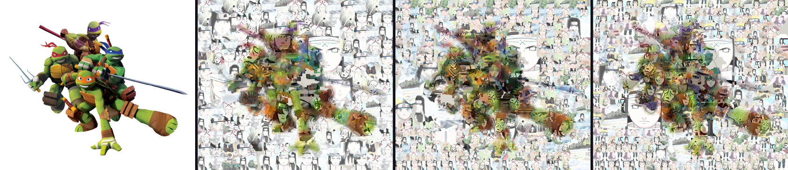

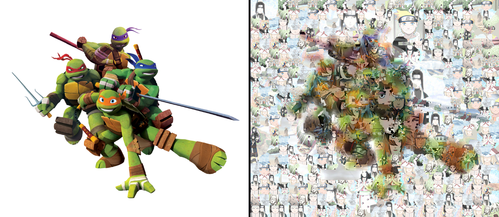

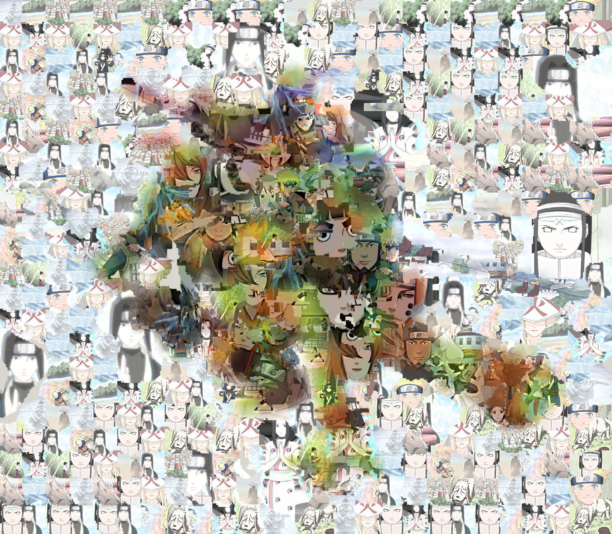

The current theme is Rick and Morty. The target is the Rick and Morty Wiki file *Smith family adult swim*: Rick and Morty standing together on a light background, Rick in the white coat with blue hair and Morty in the yellow shirt. The piece library is the TMNT stills. The Rick and Morty URL list, which supplies the target, is in [docs/showcase/rick-sources.tsv](docs/showcase/rick-sources.tsv). They are well-lit character pictures, including the Smith family and other bright figures, chosen for yellow, blue, white, and skin tones. A dark frame is not used. A flat border is flooded away to leave the subject. A bright picture that already fills the frame stays as a light-edged stamp. The collage seed is 4. The grid seed is 7. The grid color-corrects each tile toward its cell at strength 0.58. The collage color-corrects each shape toward its region at strength 0.72. These files sit beside the Naruto pictures; they do not replace them.

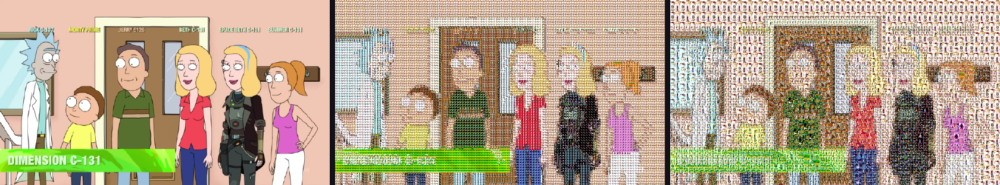

The grid comparison is the target, then average-RGB selection, then the OKLab matcher. Both selections use the same 64-column grid, seed 7, and color correction at strength 0.58.

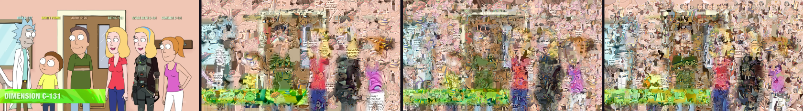

The collage row is the target, then 220 larger shapes, then the current collage, then the same settings using the opaque photos. Every visible piece is at least 4.5% of the short side, so the 1,800-piece request places a few hundred readable crops instead of slivers. Repetition radius is 2 so one source cannot tile the row beside itself. Color correction strength is 0.72. Large pieces are reserved for flat areas.

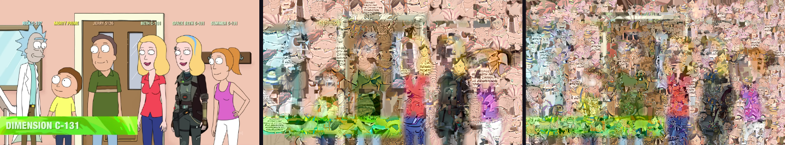

Shape row: the target, then 160 large shapes at 8–20% scale, then the current collage, whose smaller cuts follow edges and still stay above the minimum piece size.

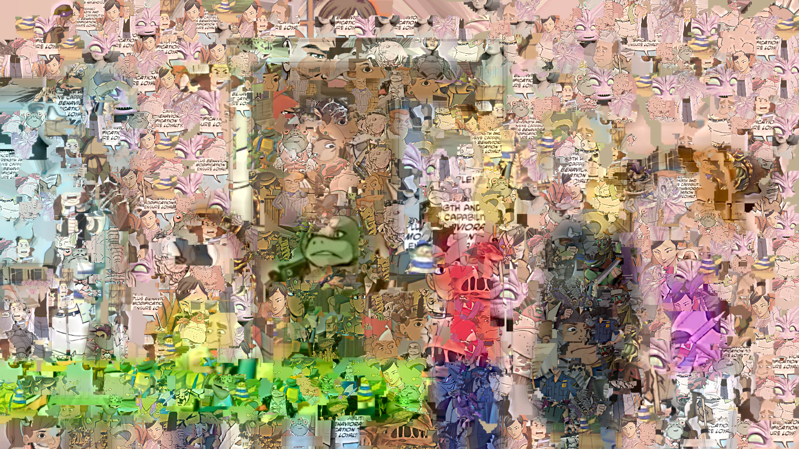

The dense collage is a full-size result on the same 4.5% floor. This 2.1.0 render places 491 pieces. The picture is 1680×945.

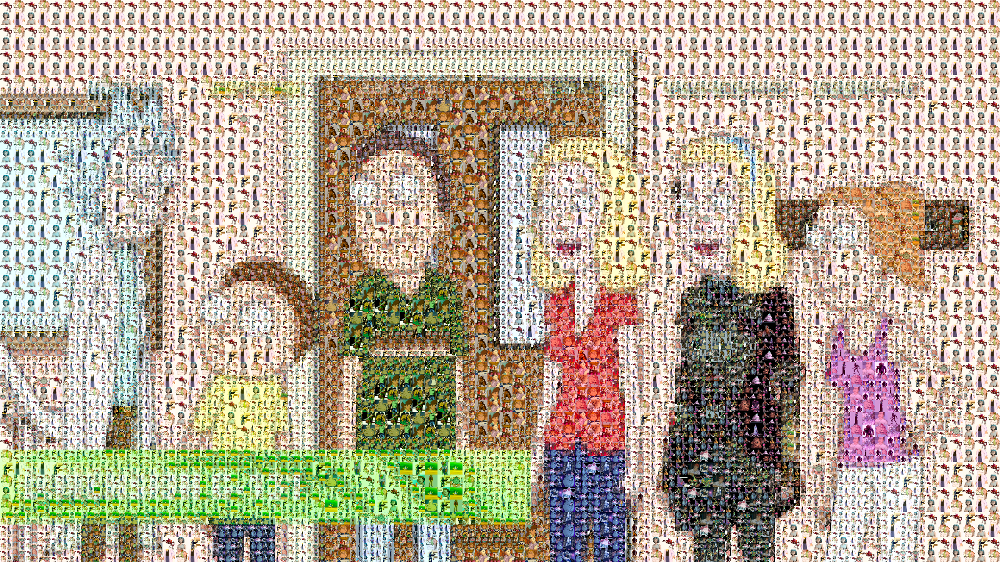

The grid is 80 columns, color correction strength 0.58, seed 7.

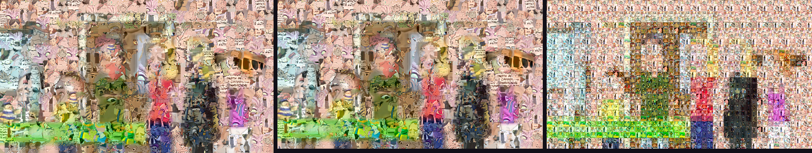

Hybrid, left to right: cutouts only, grid under the collage, collage under the grid. Each asks for 480 pieces on a 48-column grid.

A full-size collage of 374 pieces is in `docs/images/rick-cutout-collage-output.png` (1680×945). The comparison strips are scaled to a 1680 px long edge. Panel renders use an 840 px long edge before they are joined.

The earlier Naruto showcase is still in `docs/images/` without a prefix. The target is the Naruto Wiki file *Team Kakashi*: Naruto, Sakura, Sasuke, and Kakashi on a white background, with orange, pink, blue, and silver large enough to read. Group pictures that also include Sai are night scenes or monochrome drawings, so this brighter photograph is the target. The piece library is the Rick and Morty stills. The Naruto URL list, which supplies the target, is in [docs/showcase/sources.tsv](docs/showcase/sources.tsv). The same cutout rules and seeds apply.


The collage row is the target, then 220 larger shapes, then the current collage, then the same settings using the opaque photos. Every visible piece is at least 4.5% of the short side, so the 1,800-piece request places a few hundred readable crops instead of slivers. Repetition radius is 2 so one source cannot tile the row beside itself. Color correction strength is 0.72. Large pieces are reserved for flat areas.

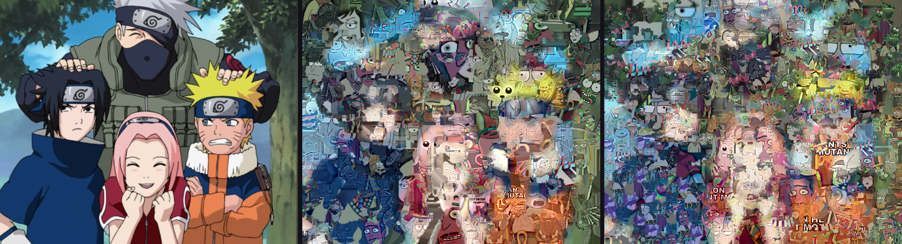

Shape row: the target, then 160 large shapes at 8–20% scale, then the current collage, whose smaller cuts follow edges and still stay above the minimum piece size.

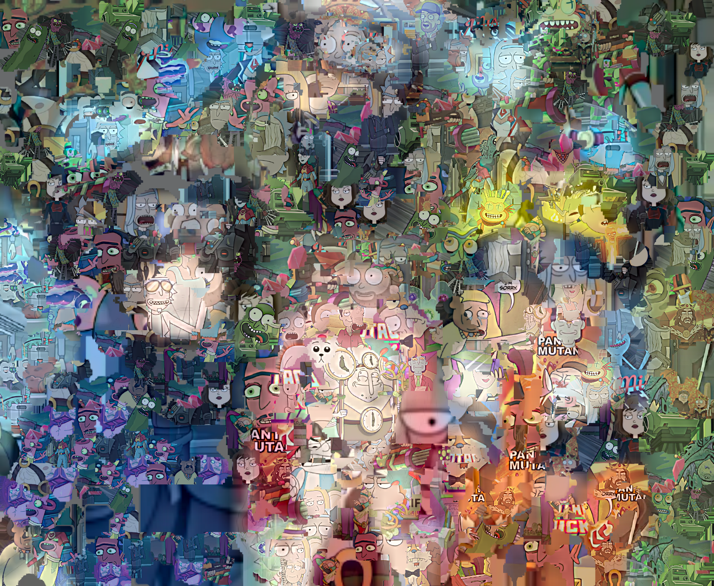

The dense collage is a full-size result on the same 4.5% floor, so it places 324 pieces rather than a field of slivers. The picture is 1680×1379.

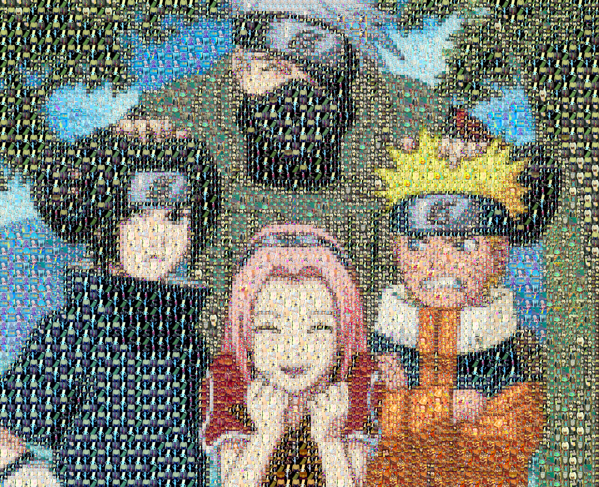

The grid is 80 columns, color correction strength 0.58, seed 7. The picture is 1680×1365.

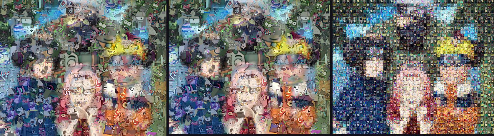

Hybrid, left to right: cutouts only, grid under the collage, collage under the grid. Each asks for 480 pieces on a 48-column grid.

A full-size collage of 324 pieces is in `docs/images/cutout-collage-output.png` (1680×1379). The comparison strips are scaled to a 1680 px long edge. Panel renders use an 840 px long edge before they are joined.

Quality on the synthetic portrait is a separate check: a face, a gradient background, and a hard-edged flower, with 120 varied tiles, a 32×42 grid, and seed 7. Both sides are the original tile pixels through the same renderer, so neither side is helped by a color wash. Lower OKLab ΔE is closer color. Higher luminance SSIM is closer structure. `MatchingQualityTest` fails if the OKLab side stops beating average-RGB on either number.

| Matcher | Mean cell OKLab ΔE | Luminance SSIM |
| --- | ---: | ---: |
| Average RGB | 0.0453 | 0.5506 |
| OKLab default | 0.0436 | 0.6559 |


The Team 7 grid comparison is the target, then average-RGB selection, then the OKLab matcher. Both selections use the same 64-column grid, seed 7, and color correction at strength 0.58, so the difference is which tile was chosen. On the synthetic portrait the same test is a 656×420 picture with the original tile pixels: the OKLab side keeps the face, the background gradient, and the red flower, and the average-RGB side breaks those regions into blockier tiles. An earlier comparison looked worse on the OKLab side because a repetition radius of 3 and a large usage penalty were discarding the best color.

## AI segmentation

Subject extraction uses on-device ML Kit. It does not upload photos. Automatic extraction, when enabled, adds cutouts beside the original photos. It does not replace them. Limits:

- maximum number of extracted subjects
- minimum subject size
- shape categories (tall, wide, compact)
- deduplication
- a cap so cutouts stay a fraction of the normal library

The cutout pool extracts subjects from many picked photos, with the same size and duplicate filters and a higher cap. Each kept mask is cleaned before it is shown: a faint halo is removed, enclosed holes are filled, tiny specks are dropped, and the outer edge is softened. Thumbnails sit on a checkerboard. You can filter by shape, remove a cutout, or clear the pool. Trim, erase, and soft edge are stored back into the pool. If the segmenter misses a shape, add or delete stamps by hand.

## Collage styles

A style is a look, separate from the quality preset's piece budget. Sparse is the one that also cuts the piece count.

| Style | Overlap | Rotation | Shadow | Outline | Feather | Coverage | Shape weight | Color |
| --- | ---: | ---: | --- | --- | ---: | ---: | ---: | --- |
| Torn paper | 0.12 | ±6° | on | off | 0.20 | 0.90 | 0.50 | Blended 0.40 |
| Hard cuts | 0.02 | ±12° | off | on | 0 | 0.72 | 0.60 | Original |
| Soft overlap | 0.70 | ±28° | off | off | 0.55 | 0.98 | 0.25 | Blended 0.72 |
| Fewer shapes | 0.08 | ±16° | on | off | 0.10 | 0.45 | 0.55 | Corrected 0.45 |
| Shaped coverage | 0.38 | unchanged | off | off | 0.08 | 0.99 | 0.40 | unchanged |

Every style cuts the target into shapes. Overlap, rotation, piece count, and color strength are what change the picture. Fewer shapes also lowers the piece count. Hard cuts is low overlap and original color, not a grid of rectangles. Feather, outline, and the separate-pieces shadow still apply to a stamp placement that has no mask.

## Stacking with the grid

The stack is part of the match fingerprint, so preview and export of one stack share a plan. Grid under collage paints the mosaic first and the cutouts on top. Collage under grid paints the cutouts first and leaves a grout gap so the collage shows between cells. Choosing Grid as the mode keeps a grid-only plan unless a hybrid stack is selected.

## Editing a result

Tap the result, then regenerate that neighborhood, swap the piece under the finger, pin it, or remove it. A pin stays through a later regenerate. Undo keeps the last 16 plans, and Redo walks forward again. Swap, pin, and remove reuse the existing plan, including each shape mask and crop. Regenerate keeps pinned pieces and pieces outside the tap, and fills the tapped area with new shapes. The current plan, both stacks, the target URI, and the library URIs are written to app storage, so a process death restores them and redraws the preview when the pictures still match. A run killed before the first plan is saved has nothing to restore. Settings, including style and stack, stay in preferences. A plan written by this version stores the crop and the mask. An older plan still opens and renders as stamps.

## Phone Studio

Grid and Collage are the first control. Style, stack, and quality sit above the library. Generate is a 52 dp bar at the bottom of a portrait phone, and Cancel replaces it while a run is in progress. The screen stays on for that run. Progress shows the stage. Save and Share sit with the title. Advanced controls stay collapsed. Landscape wider than 700 dp splits the target and the controls into two columns. Tap targets for the primary chips are at least 48 dp. The layout mock below is drawn from that hierarchy. It is not a photograph of a device.

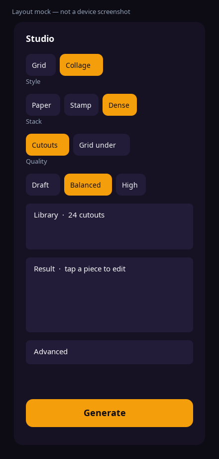

## Privacy and API keys

There is no developer API key in the app. An optional key you type is encrypted with an Android Keystore master key (`EncryptedSharedPreferences`) and stays on the device. If the keystore cannot be opened, the key is not written to plain preferences. A key left in the old plaintext setting is copied into encrypted storage and then removed.

This version does not send that key anywhere. Segmentation is on-device. The field is kept so a key you already saved is still available and is no longer stored in plaintext.

## Projects

Project metadata lives in Room (`mosaic.db`). Image files stay in app storage. Writes go to a temporary file, are flushed, then renamed. On launch, a missing preview or full image is marked on the project, and files that no longer belong to a project are deleted. An existing `library_index.json` is imported once and renamed to `library_index.json.migrated`.

## Build

Requirements: JDK 17, Android SDK 36.

```bash
./gradlew :engine:test
./gradlew :engine:benchmark
./gradlew :app:assembleDebug
./gradlew :app:assembleRelease
./gradlew :app:bundleRelease
```

Debug output: `app/build/outputs/apk/debug/app-debug.apk`

Without `keystore.properties`, release packaging still succeeds and produces an unsigned APK (`app-release-unsigned.apk`) and an unsigned AAB. To sign a release, create a gitignored `keystore.properties`:

```properties
storeFile=release.jks
storePassword=
keyAlias=
keyPassword=
```

Do not commit that file or the keystore.

## Testing

JVM tests cover OKLab conversion, histograms, cropping, descriptors, candidate indexing, repetition, usage balance, grid planning, non-square cells, cutout masks, shaped collage placement, cancellation, atomic writes, and golden images. The grid golden digest is SHA-256 `d1a220dd54d8b766667c236a44c91e01e3d53afd6c4a9393adb7e23d6fade175`. The cutout-collage golden digest is SHA-256 `65776d15ebfb1f1de2bd1a1565f9b493e1c0794b12312749d279863429e12946`. The shaped-grid golden digest is SHA-256 `4e9a75d488fd2c1b26231d1b3fed192cd7c380b5ea491423816771807d1e969b`. Same-source adjacency tests require zero violations on random seeds and, when the gitignored stills are present, on every showcase theme for both collage and grid. Edge fidelity compares a 64 px Sobel map of the output with the target: F1 allows a one-pixel miss, and chamfer is the mean Chebyshev distance from each output edge to the nearest target edge. A blank field against a boxed outline must score F1 under 0.35. An identical box must score F1 above 0.75 and chamfer under 1.5. The collage regression, with color correction at 0.72, requires at least 96% of the preview painted, masked OKLab ΔE under 0.055, masked luminance SSIM above 0.55, edge ΔE under 0.09, distance ΔE under 0.048, and distance SSIM above 0.75. Texture visibility, high-frequency energy of the corrected render divided by the same plan with correction off, must stay above 0.62. It also requires pyramid ΔE under 0.055 and pyramid SSIM above 0.72. Distance readability area-averages the collage and the target to 64 pixels wide, then measures mean OKLab ΔE and luminance SSIM, so texture inside a piece does not hide a missed color mass. On the portrait regression this run measured distance ΔE 0.0294, distance SSIM 0.883, and texture visibility 0.679. Pyramid readability repeats that on four scales and weights the coarser scales more. A two-tone picture must keep the top half on the light sources and the bottom half on the dark sources, with edge alignment above 1.4.

```bash
./gradlew :engine:test :engine:detekt :app:detekt :app:lintDebug
```

`ProjectDaoTest` is an instrumented Room test. CI runs it on an API 29 emulator. It needs a device or emulator locally:

```bash
./gradlew :app:connectedDebugAndroidTest
```

## Release procedure

GitHub Actions (`.github/workflows/ci.yml`) runs engine tests, detekt, benchmarks, Android lint, debug and release packages, and the instrumented test. Release signing uses these repository secrets when they are present:

- `KEYSTORE_BASE64`
- `STORE_PASSWORD`
- `KEY_ALIAS`
- `KEY_PASSWORD`

If `KEYSTORE_BASE64` is empty, the workflow logs that and still builds unsigned artifacts. Upload the AAB to Play Console from a machine that has the real upload key. This repository does not contain one.

A green push of `cursor/collage-tuning-loop-fcee` publishes the debug APK as a prerelease. The tag is `v2.1.0-dev`. The file is `app-debug.apk`.

https://github.com/Intrusive-Thots/Mosaic/releases/download/v2.1.0-dev/app-debug.apk

Version 2.1.0 (versionCode 3). Copies of one source may be flipped, rotated, and resized, and they must not touch. On the crossover set at 560 px and 640 pieces, same-source touches are 0, 36–59 sources are reused, and edge F1 is 0.80–0.87. Uniform grids place smaller cells along outlines. A light ink pass follows the target's line art. The About screen reads `BuildConfig.VERSION_NAME`.

## Known limitations

- Photo picker batches are capped at 100 images by the system picker contract. Add more in further picks.
- Ultra output is a large PNG. The renderer streams it, but the device still needs enough free storage. The app checks free space before a full render and refuses when the estimate plus an 8 MB reserve does not fit.
- Descriptor modified time is whatever the content provider reports. Providers that omit it fall back to file size, so a same-size replacement may reuse a cached descriptor until the photo is removed and added again.
- ML Kit subject segmentation needs the Play services model. The first extraction can fail until that model is available. The app keeps the original photos either way.
- Benchmark heap figures move around with the garbage collector. Use the probe counts and stage times for comparisons.
- Process death, a real low-memory device, and Play Console signing were not exercised in the automated JVM run. Projects are reloaded from Room on startup, and generation is cancelled by cancelling the coroutine job.
